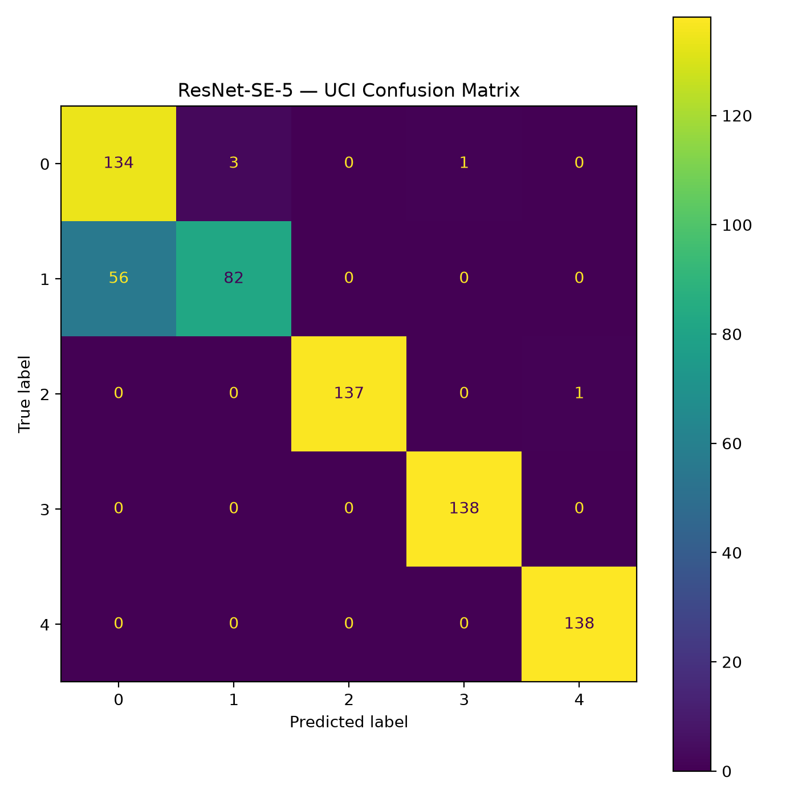
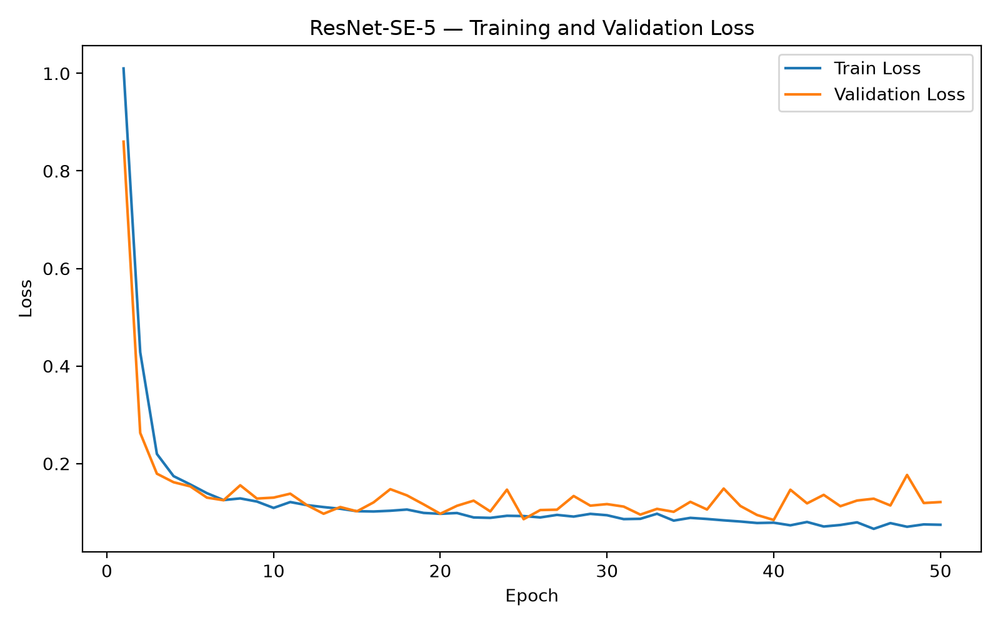
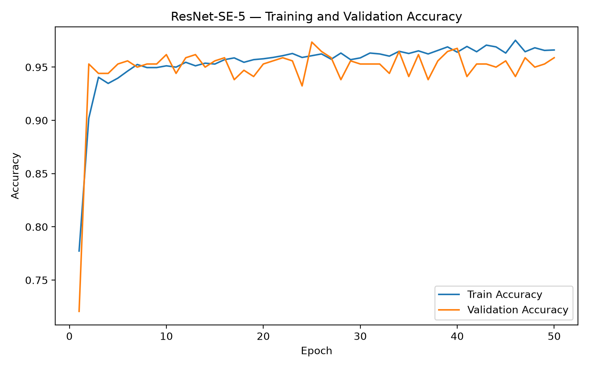

# Smartphone-HAR

A smartphone-based Human Activity Recognition (HAR) project based on the research paper:

**"Benchmarking Encoders and Self-Supervised Learning for Smartphone-Based Human Activity Recognition"**

The project is being developed as a reproducible benchmark for supervised and self-supervised learning methods on smartphone inertial sensor data.

---

## Current Status

### Phase 1 — Foundation, Dataset Pipeline & Supervised Baseline

**Status: ✅ Completed Building**

The complete data and training pipeline has been implemented and successfully tested on GPU.

| Component | Status |
|---|---|
| Project structure | ✅ |
| Python virtual environment | ✅ |
| PyTorch installation | ✅ |
| NVIDIA CUDA/GPU support | ✅ |
| DAGHAR UCI dataset | ✅ |
| Dataset inspection | ✅ |
| Data preprocessing | ✅ |
| PyTorch Dataset | ✅ |
| DataLoader | ✅ |
| ResNet-SE-5 model | ✅ |
| Forward/backward GPU test | ✅ |
| Supervised training pipeline | ✅ |
| 5-epoch smoke test | ✅ |
| Baseline evaluation | ✅ |
| Confusion matrix | ✅ |
| Learning curves | ✅ |
| Final 50-epoch baseline | ✅ |

The 5-epoch run was a successful **pipeline smoke test**. The final Phase 1 baseline should be run for the configured full training schedule before Phase 1 is marked complete.

---

## Project Roadmap

```text
Phase 1
Foundation + Dataset + Supervised Baseline
        │
        ├── Environment
        ├── DAGHAR UCI
        ├── Preprocessing
        ├── DataLoader
        ├── ResNet-SE-5
        ├── Supervised Training
        └── Evaluation
                │
                ▼
Phase 2
Self-Supervised Learning
        │
        ├── LFR
        ├── TNC
        ├── DIET
        └── TF-C
                │
                ▼
Phase 3
Fine-Tuning + Few-Shot Learning
                │
                ▼
Phase 4
Multiple Encoders
        │
        ├── ResNet-SE-5
        ├── CNN-PFF
        ├── TS-TCC
        ├── TS2Vec
        ├── IMU Transformer
        └── RNN
                │
                ▼
Phase 5
Multiple HAR Datasets
        │
        ├── UCI HAR
        ├── MotionSense
        ├── KuHAR
        ├── RealWorld-Waist
        ├── RealWorld-Thigh
        └── WISDM
                │
                ▼
Phase 6
Statistical Benchmarking
        │
        ├── Multiple random seeds
        ├── Mean ± standard deviation
        ├── Wilcoxon signed-rank test
        ├── Bonferroni correction
        ├── Inference time
        └── Model size
```

---

## Phase 1 Work Completed

### 1. Development Environment

The project uses a Python virtual environment on Windows.

Main development tools:

- Python 3.12
- VS Code
- Git / Git Bash
- PyTorch
- CUDA
- NumPy
- Pandas
- Scikit-learn
- Matplotlib
- Jupyter
- tqdm

The project uses GPU acceleration when CUDA is available.

```python
DEVICE = torch.device(
    "cuda" if torch.cuda.is_available() else "cpu"
)
```

---

### 2. Dataset

The initial dataset is the **UCI dataset processed through DAGHAR's standardized representation**.

Dataset location:

```text
data/processed/daghar/standardized_view/UCI/
├── train.csv
├── validation.csv
└── test.csv
```

Current dataset dimensions:

```text
Train      : 2420 samples
Validation : 340 samples
Test       : 690 samples
```

The current standardized representation contains:

- 6 sensor channels
- 150 time steps per sample
- 5 activity classes

Input tensor format:

```text
[batch_size, 6, 150]
```

The six sensor channels are:

```text
accel-x
accel-y
accel-z
gyro-x
gyro-y
gyro-z
```

---

## 3. Dataset Inspection

A dataset inspection script was created:

```bash
python scripts/inspect_dataset.py
```

The inspection verified:

- Dataset files exist
- CSV files load correctly
- Sensor columns are present
- Number of timesteps is correct
- Labels are available
- Data can be converted to NumPy tensors

The resulting input shape is:

```text
(2420, 6, 150)
(340, 6, 150)
(690, 6, 150)
```

---

## 4. Preprocessing Pipeline

The preprocessing pipeline converts DAGHAR CSV data into tensors suitable for PyTorch.

Main modules:

```text
preprocessing/
├── load_data.py
├── preprocess.py
├── windowing.py
└── dataset.py
```

The pipeline performs:

```text
DAGHAR CSV
    ↓
Load dataframe
    ↓
Extract 6 sensor channels
    ↓
Order 150 timesteps
    ↓
Convert to float32
    ↓
Create X and y
    ↓
PyTorch Dataset
```

---

## 5. PyTorch Dataset & DataLoader

A custom `HARDataset` was implemented.

Each sample is returned as:

```text
X → torch.float32
y → torch.int64
```

Example batch:

```text
X shape: torch.Size([64, 6, 150])
y shape: torch.Size([64])
```

The DataLoader was tested successfully.

Script:

```bash
python scripts/test_dataloader.py
```

---

## 6. ResNet-SE-5

The first supervised encoder is a custom working implementation of **ResNet-SE-5** for 1D smartphone sensor time series.

Architecture components include:

- 1D convolutional stem
- Residual blocks
- Squeeze-and-Excitation blocks
- Batch normalization
- ReLU activations
- Global average pooling
- Fully connected classifier

Model file:

```text
models/resnet_se.py
```

Input:

```text
[batch, 6, 150]
```

Output:

```text
[batch, 5]
```

> Note: The current implementation is a working ResNet-SE-5 baseline. Before publishing final benchmark numbers, the architecture and hyperparameters should be cross-checked against the official benchmark implementation for exact reproduction.

---

## 7. GPU Training

The model was tested with:

- Forward pass
- Cross-entropy loss
- Backward pass
- Optimizer step
- CUDA synchronization

The training pipeline successfully runs on the NVIDIA GPU.

The project automatically selects:

```text
CUDA → if available
CPU  → otherwise
```

---

## 8. Supervised Training

Training code:

```text
training/supervised.py
scripts/run_supervised.py
```

The training pipeline performs:

```text
Load dataset
    ↓
Create DataLoaders
    ↓
Create ResNet-SE-5
    ↓
CrossEntropyLoss
    ↓
Adam optimizer
    ↓
Train
    ↓
Validate
    ↓
Save best checkpoint
    ↓
Evaluate on test set
    ↓
Save metrics
```

Current configuration:

```text
Batch size      : 64
Learning rate   : 0.0001
Optimizer       : Adam
Loss            : CrossEntropyLoss
Random seed     : 42
```

The 5-epoch smoke test completed successfully.

---

## 9. Output Files

Successful training generates:

```text
results/
├── metrics/
│   └── resnet_se5_uci_supervised.json
├── models/
│   └── resnet_se5_uci_supervised.pt
├── confusion_matrices/
└── learning_curves/
```

The model checkpoint contains:

- Model state dictionary
- Label mapping
- Validation accuracy
- Best epoch

The metrics JSON contains:

- Training loss
- Training accuracy
- Validation loss
- Validation accuracy
- Test loss
- Test accuracy
- Training configuration
- Label mapping

---

# Completing Phase 1

## Step 1 — Run the final baseline

The 5-epoch run was only a smoke test.

For the actual baseline, change:

```python
NUM_EPOCHS = 50
```

in:

```text
config.py
```

Then run:

```bash
python scripts/run_supervised.py
```

Do not delete the existing checkpoint unless you intentionally want to restart the experiment.

---

## Step 2 — Evaluate the final checkpoint

After the final run:

```bash
python scripts/evaluate_baseline.py
```

This generates:

```text
results/metrics/resnet_se5_uci_classification_report.json
results/confusion_matrices/resnet_se5_uci_confusion_matrix.png
```

---

## Step 3 — Generate learning curves

Run:

```bash
python scripts/plot_learning_curves.py
```

This generates:

```text
results/learning_curves/resnet_se5_uci_loss.png
results/learning_curves/resnet_se5_uci_accuracy.png
```

---

# Repository Structure

```text
Smartphone-HAR/
│
├── data/
│   ├── raw/
│   ├── processed/
│   │   └── daghar/
│   │       └── standardized_view/
│   │           └── UCI/
│   │               ├── train.csv
│   │               ├── validation.csv
│   │               └── test.csv
│   └── splits/
│
├── preprocessing/
│   ├── __init__.py
│   ├── load_data.py
│   ├── preprocess.py
│   ├── windowing.py
│   └── dataset.py
│
├── models/
│   ├── __init__.py
│   └── resnet_se.py
│
├── ssl/
│   ├── __init__.py
│   ├── lfr.py
│   ├── tnc.py
│   ├── diet.py
│   └── tfc.py
│
├── training/
│   ├── __init__.py
│   ├── supervised.py
│   ├── pretrain.py
│   └── finetune.py
│
├── evaluation/
│   ├── __init__.py
│   ├── metrics.py
│   ├── confusion_matrix.py
│   └── statistical_tests.py
│
├── scripts/
│   ├── inspect_dataset.py
│   ├── test_dataloader.py
│   ├── test_model.py
│   ├── run_supervised.py
│   ├── evaluate_baseline.py
│   └── plot_learning_curves.py
│
├── notebooks/
│   ├── 01_dataset_analysis.ipynb
│   ├── 02_preprocessing.ipynb
│   ├── 03_supervised_baseline.ipynb
│   └── 04_ssl_experiments.ipynb
│
├── results/
│   ├── metrics/
│   ├── confusion_matrices/
│   ├── learning_curves/
│   ├── figures/
│   └── tables/
│
├── experiments/
│   └── configs/
│
├── tests/
│
├── config.py
├── requirements.txt
├── README.md
├── LICENSE
└── .gitignore
```

---

# Installation

## 1. Clone the repository

```bash
git clone <YOUR_GITHUB_REPOSITORY_URL>
cd Smartphone-HAR
```

## 2. Create virtual environment

```bash
python -m venv .venv
```

Activate on Git Bash:

```bash
source .venv/Scripts/activate
```

## 3. Install dependencies

```bash
python -m pip install -r requirements.txt
```

For a CUDA-enabled PyTorch installation, use the appropriate official PyTorch wheel for your system.

## 4. Verify PyTorch

```bash
python -c "import torch; print(torch.__version__); print(torch.cuda.is_available()); print(torch.cuda.get_device_name(0) if torch.cuda.is_available() else 'CPU')"
```

---

# Reproducibility

Experiments should record:

- Dataset version
- Dataset split
- Model architecture
- Learning rate
- Batch size
- Number of epochs
- Random seed
- Device
- PyTorch version
- CUDA version

Final benchmark experiments will use multiple random seeds in later phases.

---

# Important Data & Git Rules

Large datasets and trained checkpoints should not normally be committed to GitHub.

Recommended `.gitignore` entries:

```gitignore
.venv/
__pycache__/
*.pyc
.ipynb_checkpoints/

data/raw/
data/processed/

results/models/
*.pt
*.pth
*.ckpt
```

Small experiment metadata, plots and JSON metrics can be committed when appropriate.

---

# Research Roadmap

The long-term objective is to benchmark supervised and self-supervised representation learning approaches for smartphone HAR.

Planned stages:

1. Establish supervised ResNet-SE-5 baseline.
2. Implement self-supervised methods.
3. Fine-tune pretrained representations.
4. Evaluate few-shot learning.
5. Compare multiple encoder architectures.
6. Evaluate multiple smartphone HAR datasets.
7. Perform statistical significance testing.
8. Compare computational efficiency.
9. Produce final benchmark tables and figures.

---

# References

Primary research paper:

**Benchmarking Encoders and Self-Supervised Learning for Smartphone-Based Human Activity Recognition**

Dataset standardization:

**DAGHAR — Dataset Aggregation for Human Activity Recognition**

Official repositories should be linked here before publication:

- DAGHAR: https://github.com/H-IAAC/DAGHAR
- Benchmark implementation: https://github.com/H-IAAC/benchmarking-encoders-ssl-har

---

# Phase 1 Completion Checklist

Before marking Phase 1 as complete:

- [x] Environment configured
- [x] CUDA/GPU working
- [x] DAGHAR UCI dataset loaded
- [x] Dataset inspected
- [x] Preprocessing implemented
- [x] PyTorch Dataset implemented
- [x] DataLoader verified
- [x] ResNet-SE-5 implemented
- [x] Forward/backward pass verified
- [x] Supervised training implemented
- [x] 5-epoch smoke test completed
- [x] Final 50-epoch baseline completed
- [x] Classification report generated
- [x] Confusion matrix generated
- [x] Learning curves generated
- [x] Final baseline results reviewed

Once the remaining items are completed, **Phase 1 is officially complete** and development can move to **Phase 2 — Self-Supervised Learning**.


## Phase 1 Results

### Confusion Matrix



### Learning Curves

#### Training & Validation Loss



#### Training & Validation Accuracy




## Setup & Run

Follow these steps to set up the project on another laptop.

### 1. Clone the repository

Open Git Bash or a terminal:

```bash
git clone <https://github.com/kalpeshdahite/SmartPhone-HAR>
cd Smartphone-HAR
```

### 2. Create a virtual environment

```bash
python -m venv .venv
```

Activate it on Windows using Git Bash:

```bash
source .venv/Scripts/activate
```

For Windows Command Prompt:

```cmd
.venv\Scripts\activate
```

For PowerShell:

```powershell
.venv\Scripts\Activate.ps1
```

### 3. Install the required libraries

```bash
python -m pip install --upgrade pip
python -m pip install -r requirements.txt
```

### 4. Install PyTorch

For GPU training, install the appropriate CUDA-enabled PyTorch version for the computer.

Verify the installation:

```bash
python -c "import torch; print('PyTorch:', torch.__version__); print('CUDA available:', torch.cuda.is_available()); print('GPU:', torch.cuda.get_device_name(0) if torch.cuda.is_available() else 'CPU')"
```

If CUDA is available, the output should show:

```text
CUDA available: True
GPU: <NVIDIA GPU name>
```

The project automatically uses CUDA when available and falls back to CPU otherwise.

### 5. Dataset setup

Place the DAGHAR standardized UCI dataset in:

```text
data/processed/daghar/standardized_view/UCI/
```

The required files are:

```text
train.csv
validation.csv
test.csv
```

The expected structure is:

```text
Smartphone-HAR/
└── data/
    └── processed/
        └── daghar/
            └── standardized_view/
                └── UCI/
                    ├── train.csv
                    ├── validation.csv
                    └── test.csv
```

### 6. Verify the dataset

Run:

```bash
python scripts/inspect_dataset.py
```

Then verify the DataLoader:

```bash
python scripts/test_dataloader.py
```

Expected batch format:

```text
X shape: torch.Size([64, 6, 150])
y shape: torch.Size([64])
```

### 7. Test the model

Run:

```bash
python scripts/test_model.py
```

This verifies the ResNet-SE-5 forward pass, loss calculation and backward pass.

### 8. Train the supervised baseline

Open:

```text
config.py
```

Set the desired number of epochs:

```python
NUM_EPOCHS = 50
```

Then run:

```bash
python scripts/run_supervised.py
```

The trained model will be saved in:

```text
results/models/
```

and training metrics will be saved in:

```text
results/metrics/
```

### 9. Evaluate the trained model

After training:

```bash
python scripts/evaluate_baseline.py
```

This generates the classification metrics and confusion matrix.

Results are saved under:

```text
results/
├── metrics/
└── confusion_matrices/
```

### 10. Generate learning curves

Run:

```bash
python scripts/plot_learning_curves.py
```

The generated plots are stored in:

```text
results/learning_curves/
```

### Quick Start

Once the repository and dataset are available, the basic workflow is:

```bash
git clone <YOUR_GITHUB_REPOSITORY_URL>
cd Smartphone-HAR

python -m venv .venv
source .venv/Scripts/activate

python -m pip install -r requirements.txt

python scripts/inspect_dataset.py
python scripts/test_dataloader.py
python scripts/test_model.py

python scripts/run_supervised.py

python scripts/evaluate_baseline.py
python scripts/plot_learning_curves.py
```

### GPU Not Available?

The project can also run on CPU because the device is selected automatically:

```python
DEVICE = torch.device(
    "cuda" if torch.cuda.is_available() else "cpu"
)
```

However, GPU acceleration is recommended for training, especially for the later self-supervised learning experiments.

### Troubleshooting

If `pip` gives an error, use:

```bash
python -m pip install -r requirements.txt
```

instead of:

```bash
pip install -r requirements.txt
```

If CUDA is not detected:

```bash
python -c "import torch; print(torch.cuda.is_available())"
```

If the dataset cannot be found, verify that these files exist:

```text
data/processed/daghar/standardized_view/UCI/train.csv
data/processed/daghar/standardized_view/UCI/validation.csv
data/processed/daghar/standardized_view/UCI/test.csv
```

Do not commit the dataset, virtual environment, or large model checkpoints to GitHub.